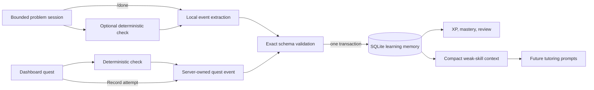

# Learning memory and progression

Sensei stores compact evidence about completed problems in a local SQLite database. The database is separate from the model context and raw conversation: an ever-growing transcript is neither a reliable mastery record nor an efficient prompt.

## Recording boundary

Nothing becomes a learning attempt automatically. Finish an active problem explicitly:

```text
/done
/done correct
/done partial
/done incorrect
```

Without an argument, the configured LLM classifies the observable student work. With an argument, the student supplies the reported outcome. The database records that report and its `model` or `student` source.

In the dashboard, **Check answer** is also non-durable. **Record attempt** is the explicit persistence action after a conclusive verifier result. The server consumes a single-use checked-attempt token so the same result cannot be recorded twice.

If the active problem also has a conclusive `/check` result, deterministic verification becomes authoritative for correctness. The original report is still stored beside the effective outcome. An inconclusive check does not override either the student or model report.

The model returns exactly five extraction fields:

- `skill_id`
- `outcome`
- `misconception`
- `evidence`
- `confidence`

The application rejects extra fields, unknown skill IDs, invalid outcomes, oversized text, and confidence outside 0-1. Invalid output receives one local repair attempt. A record is not written if validation still fails.

## Data flow



Only the active problem, structured event, and concise observable evidence cross into durable memory. The raw message list is discarded when the problem resets.

## Schema version 4

| Table | Purpose |
| --- | --- |
| `schema_migrations` | Records applied database versions. |
| `skills` | Seeds the versioned 37-skill course catalog and prerequisites. |
| `attempts` | Stores one completed problem's structured evidence and help use. |
| `misconceptions` | Consolidates repeated misconception descriptions by skill. |
| `mastery` | Stores the current evidence score, counts, streak, and review date per skill. |
| `xp_events` | Stores additive XP linked one-to-one with an attempt or, since schema version 11, a completed lesson. |

Foreign keys are enabled and the mutation for one attempt is atomic. The database uses SQLite WAL mode and defaults to `data/sensei.db`, which is ignored by Git.

Schema version 2 added `reported_outcome`, `effective_outcome_source`, verification status and kind, verifier version, submitted and expected expressions, and a concise check detail to each attempt. Existing version-1 attempts migrate automatically: their original outcome becomes the report, their effective source is `reported`, and their verification status is `unverified`.

Schema version 3 adds the optional `quest_id`. Existing attempts migrate with a null quest ID. Curated quests supply an authoritative skill ID; when their answer is also conclusively verified, progression confidence is 1.0 because neither the skill classification nor correctness depends on the model.

Schema version 4 adds a required `course` field to every skill. Existing skill rows migrate as Calculus, then catalog synchronization assigns the 20 new Precalculus skills and preserves all prior mastery and attempt relationships. Course is returned with skill progress and recent attempts so the dashboard can present separate paths without creating separate databases.

The outcome trust order is:

1. A conclusive deterministic check (`verified_correct` or `verified_incorrect`).
2. An explicit student report supplied to `/done`.
3. The configured LLM's structured classification.

This order affects XP, mastery, and scheduling, while provenance keeps disagreements inspectable.

## XP rules

XP rewards practice effort and is deliberately separate from mastery. Already-earned XP
is never deducted. For a pending attempt, each **Ask Sensei for help** step reduces the
available XP by 5 (never below zero), and revealing the final-answer step makes the
attempt worth zero XP.

| Outcome | XP |
| --- | ---: |
| Incorrect | 5 effort XP |
| Partial | 5 effort + 7 progress = 12 XP |
| Correct independently | 5 effort + 15 correct + 5 independence = 25 XP |

A correct attempt is therefore worth 20 XP after one help step, 15 after two, and so
on. Partial and incorrect rewards use the same 5-XP-per-step reduction. The dashboard
shows the remaining correct-answer reward after every help request.

Level 1 requires 100 XP to advance, level 2 requires another 200, level 3 another 300, and so on. This produces visible progress without disguising it as subject mastery.

## Mastery rules

Each result begins with an evidence value:

- correct: 100
- partial: 55
- incorrect: 0

Each non-final **Ask Sensei for help** step subtracts 15 from the raw evidence value,
never below zero. If the progressive help sequence reaches its final-answer step, the
attempt contributes zero mastery evidence. Otherwise extraction confidence pulls
uncertain evidence toward neutral 50:

```text
adjusted = 50 + (raw - 50) * confidence
```

Mastery uses every recorded attempt and stays separate from XP. The evidence average
captures how consistently the learner answers correctly, including reductions for help,
partial answers, wrong answers, and low-confidence evaluation. A practice-confidence
factor prevents a tiny sample from looking like mastery:

```text
accuracy = total evidence / attempts
practice confidence = sqrt(min(attempts / 10, 1))
mastery = accuracy * practice confidence
```

One perfect first attempt is therefore `31.62/100`, five perfect attempts are
`70.71/100`, and seven perfect attempts reach `83.67/100`. Ten attempts provide full
practice confidence; from then on, the score is the quality-adjusted evidence average.
Because every attempt remains in that average, high-quality correct answers strengthen
the score while partial and incorrect answers reduce its accuracy component. Incorrect
attempts still earn effort XP, but they add no mastery evidence.

Labels require repeated success:

- `mastered`: score at least 80 and at least three correct attempts
- `proficient`: score at least 65 and at least two correct attempts
- `developing`: score at least 35
- `beginning`: any lower practiced score
- `not started`: no attempts

These rules are transparent initial heuristics, not a validated learning-science model. They should evolve through study data and tests rather than hidden prompt changes.

## Review scheduling

Independent correct streaks schedule reviews after 2, 4, 8, 16, and at most 32 days. A correct result with help schedules two days; partial and incorrect results schedule the next day. Any non-independent result resets the independent streak.

`/review` prioritizes overdue work, then the earliest review date and lower mastery. It reports the most frequent unresolved misconception for that skill when one exists.

## Adaptive prompting

Sensei retrieves at most five of the lowest-scoring practiced skills and their unresolved misconceptions. This compact summary is added to the single system message for future problems. The tutor is instructed to use a record only when relevant and not reveal scores unless asked.

No old problem transcript is replayed. This keeps personalization approximately constant in size as the database grows.

## Student-owned data controls

| Command or option | Behavior |
| --- | --- |
| `/export [path]` | Writes a new JSON export and refuses to overwrite an existing file. |
| `/backup [path]` | Uses SQLite's backup API and refuses to overwrite an existing file. |
| `/delete-data` | Requires exact `DELETE` confirmation, clears personal records, and keeps the empty schema and skill catalog. |
| Dashboard **Restart** | Clears one topic's attempts, XP, mastery, misconceptions, and review progress while keeping the topic and folder. |
| Dashboard **Delete** | Clears the same topic-specific learning data and removes learner-created topic metadata. |
| `--database PATH` | Uses another local database. |
| `--no-memory` | Runs without opening or writing a learning database. |

Default exports and backups are created under ignored `data/exports/` and `data/backups/`. JSON exports include problem text and are personal. `/delete-data` affects the active database only; separate exports and backups remain until the student removes them.

## Schema version 10

| Table | Purpose |
| --- | --- |
| `topic_materials` | Pasted or scanned class material per topic: kind, body, optional solution, source label. |
| `subject_profiles` | One course profile per subject with the professor's conventions. |

Materials are course content rather than progress: **Restart** keeps them and
**Delete** removes them with the topic. JSON exports include both tables.

## Schema version 11

| Table | Purpose |
| --- | --- |
| `topic_lessons` | One guided lesson per topic: the validated lesson JSON (including private check-in answers), `step_count`, `current_step`, `completed_at`, and `xp_awarded`. |
| `xp_events` | Rebuilt so `attempt_id` is nullable and a new `lesson_id` column references `topic_lessons`; a check constraint requires exactly one of them. |

Completing a lesson inserts one `xp_events` row of 25 points. Replacing a lesson with
**Start lesson over** keeps the row id and `xp_awarded`, so the bonus is one-time per
topic. Lessons never write to `attempts` or `mastery`.

## Difficulty tiers

Generation receives a `difficulty_tier` derived from the mastery label and recent
outcomes: `standard` for a new or developing topic, `foundational` once a topic is
`beginning` with at least three attempts, `challenging` when `proficient`, and
`synthesis` when `mastered`. Two consecutive incorrect outcomes step the tier down;
three consecutive correct outcomes step it up. The rule is a pure function
(`difficulty_tier`) and is tested directly.

## Misconception capture and resolution

Dashboard attempts that are incorrect or partial, and did not reveal the final
answer, trigger one short classification call. The finding must be a compact
`misconception`, `evidence`, and `confidence` record; findings below 0.5 confidence
or with a null misconception are discarded, and any provider failure is logged
and ignored. Stored misconceptions are fed back into generation as "known weak
spots" and are marked resolved after two independent correct answers in a row.
A recurrence reopens the record and increments its count.

Multi-part problems record `partial` when some parts are correct. The evidence and
XP values in the tables above apply unchanged.

## Current limitations

- Deterministic checks cover a deliberately restricted single-variable expression grammar; unsupported work remains student-reported or model-classified.
- The catalog provides broad Precalculus and Calculus I paths rather than mirroring one specific college syllabus.
- One local database represents one learner; profiles and multi-user isolation are not implemented.
- Misconception names come from a model classification of one wrong answer; the
  two-correct-answers resolution rule is a heuristic, not a validated model.
- Partial credit records a fixed 55 evidence regardless of how many parts were right.
- Review intervals and mastery weights are transparent heuristics that still need evaluation.
- The retrieval summary is skill-level rather than embedding-based; this is intentional until the smaller design proves insufficient.
