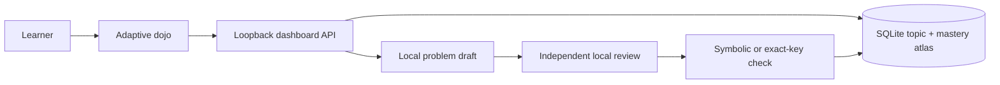

# Learner-directed RPG dashboard

The dashboard is Sensei's local practice, tutoring, and progression interface. Instead of enrolling the learner in a fixed course, it asks what they want to practice and grows a personal mastery atlas from those requests.

## Start the dashboard

From the repository root:

```powershell
python -m sensei.dashboard
```

Use `--fast` for the lighter Qwen 3.5 4B model. An editable installation also provides `sensei-dashboard`. The default address is `http://127.0.0.1:8765/`, and the system browser opens automatically. `--no-open`, `--port PORT`, `--database PATH`, `--model-id ID`, `--models-dir PATH`, `--runtime-dir PATH`, and `--server-url URL` mirror the corresponding local runtime controls. `--no-model` keeps only the legacy deterministic generators available for diagnostics.

## Practice loop

1. Enter a broad subject, such as **Mathematics** or **Chemistry**.
2. Enter the topic or skill to practice.
3. Optionally paste an objective, notes excerpt, formula emphasis, or test scope.
4. Choose the problem difficulty: **Beginner**, **Intermediate**, **Advanced**, or **Expert**.
5. Solve the expression question or select one of four conceptual answers.
6. Ask for the stored hint if needed, check the response, and study the walkthrough.
7. Claim XP to record mastery and place the topic into spaced review.

The topic remains in the learner's atlas. Later encounters can start from its card or from Sensei's review recommendation. Every generation action has its own difficulty selector, including **New encounter** in the open arena. The most recent choice becomes that topic's default without fragmenting its history.

The four levels have fixed generation contracts:

- **Beginner:** one direct step using the topic's essential concepts, familiar values, and clear guidance.
- **Intermediate:** a standard application with two or three connected steps.
- **Advanced:** multi-step reasoning, less obvious setup, and less scaffolding.
- **Expert:** the topic's most demanding reasonable work, including synthesis or subtle constraints with minimal scaffolding.

## Validation boundary

Adaptive generation has three gates:

1. The local model must return an exact, size-bounded problem schema.
2. A separate local-model review pass recomputes the answer and rejects ambiguous or off-topic drafts.
3. The issued quest must use a locally checkable answer contract: restricted symbolic equivalence for quantitative work or an exact four-option key for conceptual work.

This substantially reduces bad generated exercises, but it is not a formal proof that every natural-language premise is scientifically correct. The interface identifies answers as checked or validated rather than claiming universal certainty. Existing Calculus and Precalculus generators continue to use their stronger subject-specific symbolic validation.

## Architecture



`sensei/practice.py` owns adaptive problem contracts, strict model-output parsing, review, and local answer checking. `sensei/dashboard.py` owns the loopback server, protected mutation endpoints, temporary hidden-answer challenge store, and model lifecycle. `sensei/storage.py` owns learner-created topics and unifies them with attempts, XP, mastery, and review scheduling. `sensei/web/` contains dependency-free HTML, CSS, and JavaScript.

## Privacy and safety boundary

- The server is fixed to `127.0.0.1` and cannot bind to the LAN.
- Model inference, source excerpts, hidden answers, learning history, and SQLite storage remain local.
- Public quest JSON excludes answer keys and solutions until after submission.
- Challenges expire after one hour and use opaque random tokens.
- Conclusive checked attempts receive short-lived, single-use record tokens.
- Writes require a per-process CSRF token and same-origin checks.
- Request sizes, field sets, text lengths, answer grammar, and model-output shapes are bounded.
- No learning state is copied into browser storage, cookies, or a hosted service.

Loopback isolation is not multi-user authentication; software already running as the same operating-system user may be able to contact local services.

## HTTP surface

| Route | Purpose |
| --- | --- |
| `/api/dashboard` | Profile, growing atlas, review data, recent attempts, runtime state, and write-session token. |
| `POST /api/study/focus` | Creates or refreshes one learner-owned subject/topic focus. |
| `POST /api/study/generate` | Drafts, reviews, and issues a fresh quest for a focus at the required `difficulty`. |
| `POST /api/quest/check` | Checks one server-held quest and reveals its walkthrough after submission. |
| `POST /api/quest/record` | Consumes a one-time token and records XP, mastery, and review state. |
| `POST /api/quest/generate` | Preserved legacy route for deterministic catalog generators. |
| `/healthz` | Minimal local health response. |
