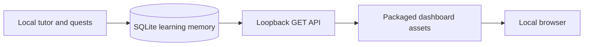

# Local RPG dashboard

The dashboard makes Sensei's existing learning state visible without moving it into a browser account or hosted service. It shows rank, level progress, XP, the next quest, all 17 mastery disciplines, review timing, and recent attempts.

## Start the dashboard

From the repository root:

```powershell
python -m sensei.dashboard
```

An editable installation also provides:

```powershell
sensei-dashboard
```

The default address is `http://127.0.0.1:8765/`, and the system browser opens automatically. Use `--no-open` to suppress that behavior, `--port PORT` to select another loopback port, or `--database PATH` to view the same custom database passed to the tutor.

The tutor and dashboard can run in separate terminals against the same SQLite file. The page refreshes its read model while visible, and the Refresh button requests an immediate snapshot.

## Architecture



`sensei/dashboard.py` owns the loopback server and public snapshot. `sensei/web/` contains dependency-free HTML, CSS, and JavaScript packaged with the Python application. `sensei/quests.py` supplies the answer-key-free next-quest representation. SQLite remains the only source of truth.

## Privacy and safety boundary

- The server address is fixed to `127.0.0.1`; there is no option to bind to the LAN.
- The server implements GET endpoints only and serves a fixed route map rather than arbitrary filesystem paths.
- The JSON response excludes quest samples and symbolic target configuration.
- Learning state is never copied into `localStorage`, cookies, or a cloud database.
- Content Security Policy, frame denial, MIME sniffing protection, and a no-referrer policy are sent on responses.
- The dashboard does not start or call the language model.
- The selected SQLite database, exports, backups, and model files retain their existing ignored/local data rules.

The dashboard is intended for the learner at the computer. Loopback isolation is not multi-user authentication; other software already running as the same local user may be able to contact local services.

## HTTP surface

| Route | Purpose |
| --- | --- |
| `/` | Packaged dashboard page. |
| `/assets/styles.css` | Responsive visual system. |
| `/assets/app.js` | Safe DOM rendering and local refresh behavior. |
| `/api/dashboard` | Profile, public quest, skills, review, and recent-attempt snapshot. |
| `/healthz` | Minimal local health response. |

Unknown routes return JSON `404`; server errors return a generic message rather than database details.
