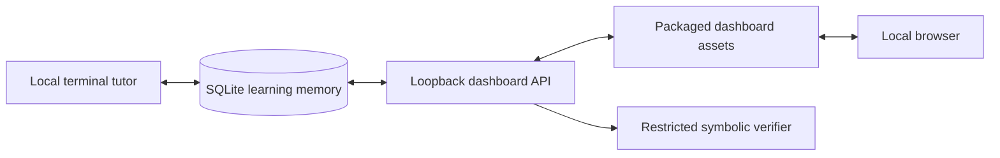

# Local RPG dashboard

The dashboard is Sensei's local practice and progression interface. It shows rank, level progress, XP, course-specific recommendations, all 20 Precalculus and 17 Calculus disciplines, review timing, and recent attempts. A learner can launch, check, and record verifier-backed quests without moving learning data into a browser account or hosted service.

## Start the dashboard

From the repository root:

```powershell
python -m sensei.dashboard
```

An editable installation also provides:

```powershell
sensei-dashboard
```

The default address is `http://127.0.0.1:8765/`, and the system browser opens automatically. Use `--no-open` to suppress that behavior, `--port PORT` to select another loopback port, or `--database PATH` to view the same custom database passed to the tutor.

The tutor and dashboard can run in separate terminals against the same SQLite file. The page refreshes its read model while visible, and the Refresh button requests an immediate snapshot.

## Practice loop

1. Choose **Precalculus** or **Calculus** at the top of the page.
2. Use a unit chip to narrow the subject cards if desired.
3. Select the recommended **Start quest**, or **Practice topic** on a specific subject.
4. Enter a mathematical expression and select **Check answer**.
5. Review the local verifier's result, then select **Record attempt** to save it.

The check and record controls are deliberately separate. Checking does not mutate learning memory. A conclusive check creates a short-lived, process-local, single-use attempt token; recording consumes it and writes exactly one progression event.

## Architecture



`sensei/dashboard.py` owns the loopback server, public snapshot, protected write endpoints, and single-use checked-attempt store. `sensei/web/` contains dependency-free HTML, CSS, and JavaScript packaged with the Python application. `sensei/quests.py` supplies answer-key-free quest representations and verifier targets. SQLite remains the only durable source of truth.

## Privacy and safety boundary

- The server address is fixed to `127.0.0.1`; there is no option to bind to the LAN.
- The server serves a fixed route map rather than arbitrary filesystem paths.
- The public JSON response excludes quest samples and symbolic target configuration.
- Writes require a per-process CSRF token, reject cross-origin browser requests, enforce small exact-shape JSON bodies, and record only a server-issued one-time checked attempt.
- Learning state is never copied into `localStorage`, cookies, or a cloud database.
- Content Security Policy, frame denial, MIME sniffing protection, and a no-referrer policy are sent on responses.
- The dashboard does not start or call the language model.
- The selected SQLite database, exports, backups, and model files retain their existing ignored/local data rules.

The dashboard is intended for the learner at the computer. Loopback isolation is not multi-user authentication; other software already running as the same local user may be able to contact local services.

## HTTP surface

| Route | Purpose |
| --- | --- |
| `/` | Packaged dashboard page. |
| `/assets/styles.css` | Responsive visual system. |
| `/assets/app.js` | Course navigation, safe DOM rendering, quest interaction, and refresh behavior. |
| `/api/dashboard` | Profile, public quests, skills, review, recent attempts, and write-session token. |
| `POST /api/quest/check` | Checks one catalog quest answer and issues a one-time token for a conclusive result. |
| `POST /api/quest/record` | Consumes a checked-attempt token and records XP, mastery, and review state. |
| `/healthz` | Minimal local health response. |

Write requests use `application/json` and the per-process `X-Sensei-CSRF` value returned by `/api/dashboard`. Unknown routes return JSON `404`; rejected writes return `400` or `403`; server errors return a generic message rather than database details.
