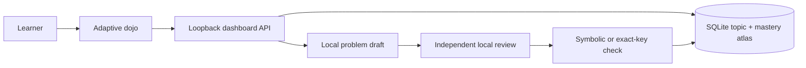

# Learner-directed RPG dashboard

The dashboard is Sensei's local practice, tutoring, and progression interface. Instead of enrolling the learner in a fixed course, it asks what they want to practice and grows a personal mastery atlas from those requests.

The interface opens in the **Dojo**, a focused conversational surface for forging a questline. **Profile** holds the learner's current rank and growing atlas, and **Past Quest** holds the adventure log of recent encounters.

## Start the dashboard

From the repository root:

```powershell
python -m sensei.dashboard
```

Use `--fast` for the lighter Qwen 3.5 4B model. An editable installation also provides `sensei-dashboard`. The default address is `http://127.0.0.1:8765/`, and the system browser opens automatically. `--no-open`, `--port PORT`, `--database PATH`, `--model-id ID`, `--models-dir PATH`, `--runtime-dir PATH`, and `--server-url URL` mirror the corresponding local runtime controls. `--no-model` keeps only the legacy deterministic generators available for diagnostics.

Use `--error-log PATH` to change the structured diagnostic-log location. Startup,
API, generation, persistence, and browser JavaScript failures receive correlation
IDs and are recorded locally; see the [local error log](ERROR_LOG.md).

## Practice loop

1. Enter a broad subject, such as **Algebra**, **Calculus**, **Chemistry**, or **Physics**. This is the top-level domain for generation.
2. Enter the exact topic or skill to practice, such as **Graphical limits**, **Properties of exponents**, or **Dimensional analysis**. This becomes the topic in the Atlas.
3. Optionally describe the problem type, learning objective, emphasis, source excerpt, or test scope in **Anything Sensei should know**. These instructions shape every problem in the chat without replacing the named subject or topic.
4. Choose **Start practice chat**. The three-part study brief appears as the learner's first message, and Sensei replies with one independently reviewed problem.
5. Solve the expression question or select one of four conceptual answers. Ask for the stored hint if needed, send the answer, and study Sensei's feedback and walkthrough.
6. Choose **Save progress to Atlas** to record mastery, then **Next problem** to continue the same questline. Sensei issues only one active problem at a time.

The topic remains in the learner's atlas under **Profile**. Later practice chats can start from its card. **Skip to next problem** replaces the current problem without recording it, while **Next problem** continues after a saved attempt. Completed encounters appear under **Past Quest**.

## Validation boundary

Adaptive generation has three gates:

1. The local model must return an exact, size-bounded problem schema.
2. A separate local-model review pass recomputes the answer; enforces the subject, topic, and practice instructions; and rejects ambiguous problems, unused or inconsistent quantitative givens, and off-topic drafts.
3. The issued quest must use a locally checkable answer contract: restricted symbolic equivalence for quantitative work or an exact four-option key for conceptual work.

This substantially reduces bad generated exercises, but it is not a formal proof that every natural-language premise is scientifically correct. The interface identifies answers as checked or validated rather than claiming universal certainty. Existing Calculus and Precalculus generators continue to use their stronger subject-specific symbolic validation.

## Architecture



`sensei/practice.py` owns adaptive problem contracts, strict model-output parsing, review, and local answer checking. `sensei/dashboard.py` owns the loopback server, protected mutation endpoints, temporary hidden-answer challenge store, and model lifecycle. `sensei/storage.py` owns learner-created topics and unifies them with attempts, XP, mastery, and review scheduling. `sensei/web/` contains dependency-free HTML, CSS, and JavaScript.

## Privacy and safety boundary

- The server is fixed to `127.0.0.1` and cannot bind to the LAN.
- Model inference, source excerpts, hidden answers, learning history, and SQLite storage remain local.
- Public quest JSON excludes answer keys and solutions until after submission.
- Challenges expire after one hour and use opaque random tokens.
- Conclusive checked attempts receive short-lived, single-use record tokens.
- Writes require a per-process CSRF token and same-origin checks.
- Request sizes, field sets, text lengths, answer grammar, and model-output shapes are bounded.
- No learning state is copied into browser storage, cookies, or a hosted service.

Loopback isolation is not multi-user authentication; software already running as the same operating-system user may be able to contact local services.

## HTTP surface

| Route | Purpose |
| --- | --- |
| `/api/dashboard` | Profile, growing atlas, review data, recent attempts, runtime state, and write-session token. |
| `POST /api/study/focus` | Creates or refreshes one learner-owned subject/topic focus. |
| `POST /api/study/generate` | Drafts, reviews, and issues a fresh quest for a focus. |
| `POST /api/quest/check` | Checks one server-held quest and reveals its walkthrough after submission. |
| `POST /api/quest/record` | Consumes a one-time token and records XP, mastery, and review state. |
| `POST /api/errors` | Accepts bounded same-origin browser diagnostics for the local error log. |
| `POST /api/quest/generate` | Preserved legacy route for deterministic catalog generators. |
| `/healthz` | Minimal local health response. |
