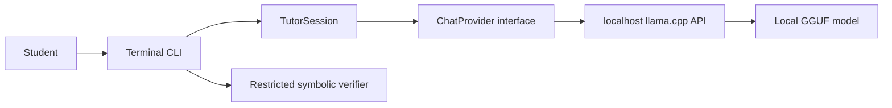

# Terminal tutor guide

Sensei's first user interface is a local terminal tutor. It manages the selected `llama.cpp` server, sends only problem-relevant context, streams the response, and stops the server when the session exits.

## Start a session

From the repository root:

```powershell
python -m sensei
```

An optional editable install adds the shorter `sensei` command:

```powershell
python -m pip install --editable . --no-deps
sensei
```

The default is Qwen 3.5 9B Q4_K_M. Start the lighter fallback with:

```powershell
python -m sensei --fast
```

Model weights are not downloaded implicitly. If the selected artifact is missing, the error gives the exact downloader command.

## Tutor commands

| Command | Behavior |
| --- | --- |
| Plain text | Uses coach mode; the first message starts a problem and later messages are attempts or questions. |
| `/hint [question]` | Gives exactly one hint without revealing the final answer. |
| `/solve [question]` | Gives a complete explained solution. |
| `/check TYPE` | Deterministically checks a `derivative`, `limit`, `antiderivative`, or pair of `equivalent` expressions through a short wizard. |
| `/done [outcome]` | Finalizes the active problem into learning memory; the optional outcome is `correct`, `partial`, or `incorrect`. |
| `/profile` | Shows level, XP, recorded attempts, and mastery totals. |
| `/skills [all]` | Shows practiced skills or the complete 17-skill catalog. |
| `/review` | Recommends the next scheduled skill and shows an unresolved misconception when present. |
| `/new [problem]` | Clears the current context and optionally starts another problem. |
| `/status` | Shows the model, active problem, tutor-turn count, and recent-context usage. |
| `/export [path]` | Exports personal learning records to a new JSON file. |
| `/backup [path]` | Creates a new SQLite backup without overwriting an existing file. |
| `/delete-data` | Clears learning records after an exact `DELETE` confirmation. |
| `/help` | Shows the command reference. |
| `/quit` | Stops the managed runtime and exits. |

Coach mode asks the student to identify the first relevant rule or structure when no attempt has been provided. It advances one small step at a time after that. The explicit `/solve` command is the escape hatch when a full walkthrough is wanted.

Run `/check` after entering an active problem and an answer. The latest conclusive check is attached to the problem, shown to the tutor on the next turn, and used as the authoritative correctness result when `/done` records progress. If the answer changes, run `/check` again. An inconclusive result is retained as provenance but does not override the reported outcome. See [deterministic verification](DETERMINISTIC_VERIFICATION.md) for supported notation and limits.

## One-shot mode

One-shot mode is useful for smoke tests and future automation:

```powershell
python -m sensei `
  --prompt "Differentiate (x^2 + 1)^3" `
  --mode hint
```

Add `--no-stream` to wait for one complete response. Use `--server-url http://127.0.0.1:8080` to connect to an already-running compatible server rather than starting one.

## Context policy

The terminal session is problem-scoped rather than an ever-growing general chat:

1. The active problem is carried separately and included in every request.
2. Only the most recent 12,000 characters of student/tutor exchanges are included.
3. `/new` discards the previous problem context immediately.
4. The tutor system policy and active help mode are rebuilt for every request.

This leaves room inside the 4,096-token runtime context for the current response while preventing later problems from inheriting irrelevant transcripts. The character limit is a conservative approximation, not a tokenizer-exact budget.

Long-term learning state is stored separately in SQLite. Up to five of the weakest practiced skills and their unresolved misconceptions are added to the system context; Sensei is instructed to use them only when relevant and not announce stored scores. Raw transcripts are not placed in learning memory. See [learning memory and progression](LEARNING_MEMORY.md) for the schema, progression rules, and data controls.

## Architecture



- `sensei/cli.py` owns terminal commands and rendering.
- `sensei/tutor.py` owns pedagogy modes and bounded context.
- `sensei/providers.py` owns the model-independent completion boundary and streaming schema.
- `sensei/verification.py` owns restricted parsing and deterministic answer checks.
- `sensei/runtime.py` owns the local server process and loopback-only configuration.
- `sensei/models.py` owns selection from the pinned model manifest.

The provider boundary allows another local runtime or model vendor to be added without moving tutoring policy into infrastructure code.

## Privacy and runtime files

- Prompts and responses are not written to the repository.
- The default database is `data/sensei.db`; all of `data/` is ignored by Git.
- The server binds to `127.0.0.1`, not the local network.
- Runtime logs are written to `data/runtime/llama-server.log`; `data/` is ignored by Git.
- Model weights, partial downloads, and raw benchmark logs remain ignored.
- The runtime is configured with reasoning output disabled. Tagged reasoning is also removed before a response is retained in session context.
- Use `--no-memory` for a stateless session or `--database PATH` for another local database.

## Verification

Run all tests:

```powershell
python -m unittest discover -s tests -v
```

The milestone was also exercised through the real Vulkan runtime with both the 9B default and 4B fallback. Live validation found and fixed a Qwen chat-template constraint that requires a single initial system message.
